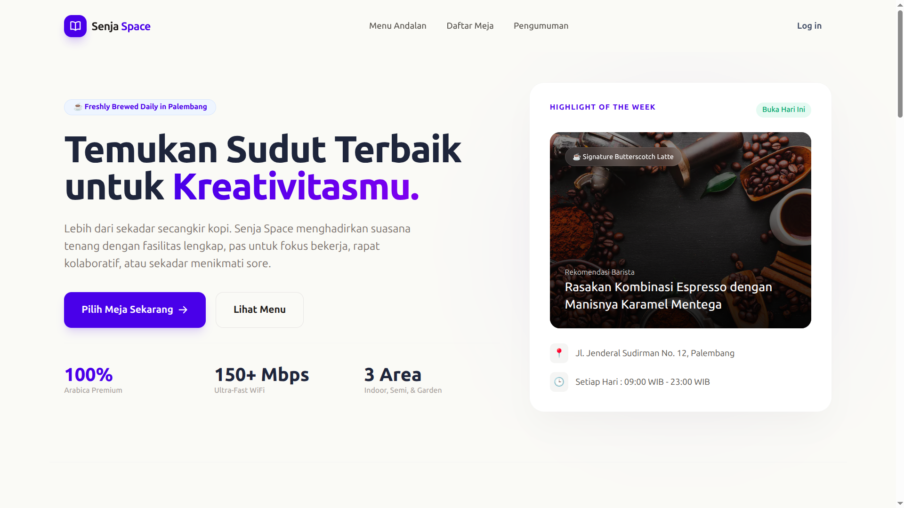
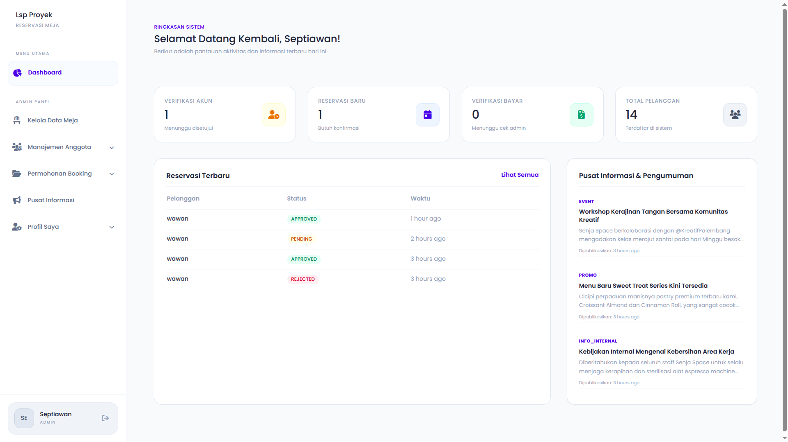
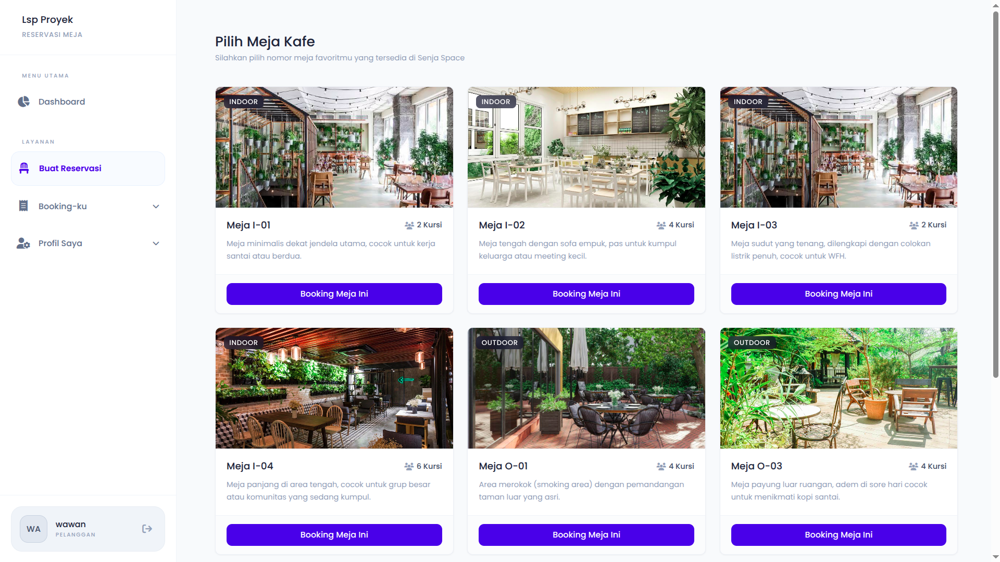
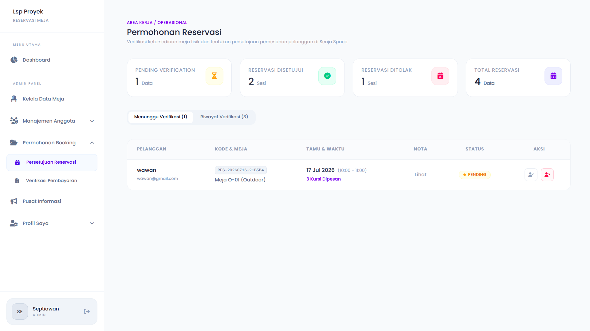
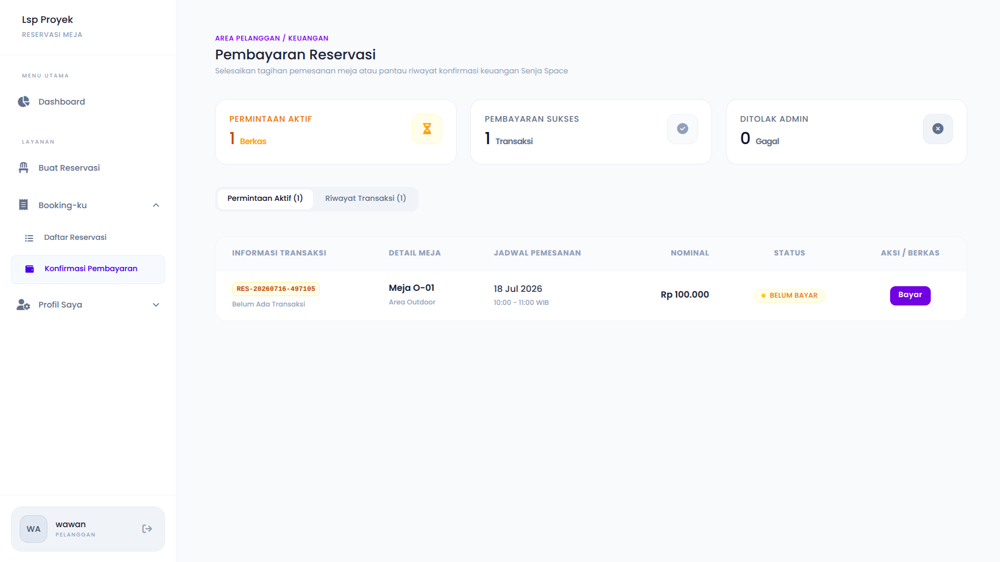
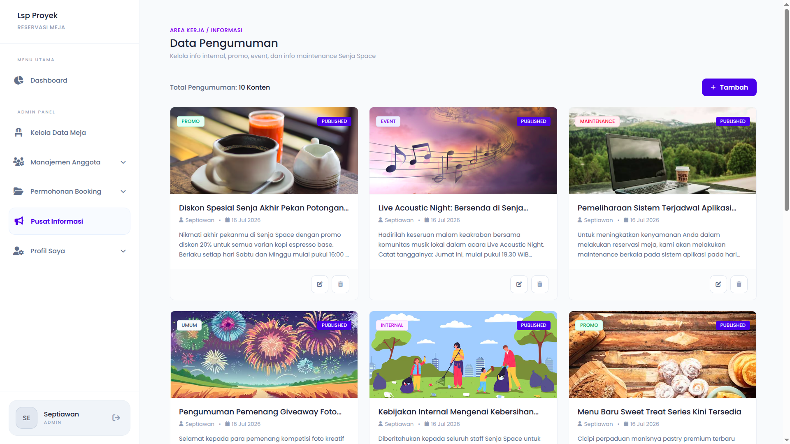

# ☕ Sistem Reservasi Meja Kafe

Sistem Reservasi Meja Kafe adalah aplikasi berbasis web yang dirancang untuk memudahkan pelanggan melakukan reservasi meja secara online tanpa harus datang langsung ke lokasi. Sistem ini juga membantu admin dalam mengelola meja, memverifikasi akun pelanggan, memproses reservasi, memverifikasi pembayaran, serta menyampaikan informasi kepada pelanggan melalui fitur pengumuman.

---

## 📸 Preview

| Halaman               | Preview                                    |
| --------------------- | ------------------------------------------ |
| Landing Page          |           |
| Dashboard             |              |
| Reservasi Meja        |         |
| Persetujuan Reservasi |  |
| Pembayaran            |  |
| Pengumuman            |             |

---

# ✨ Features

## 👤 Customer

- Registrasi akun
- Melihat status pendaftaran akun
- Login
- Melihat daftar meja
- Reservasi meja
- Melihat detail reservasi
- Melihat riwayat reservasi
- Konfirmasi pembayaran
- Mengubah profil
- Melihat pengumuman

---

## 👨‍💼 Admin

- Login
- Dashboard Admin
- Verifikasi akun pelanggan
- CRUD data meja
- Verifikasi reservasi
- Verifikasi pembayaran
- CRUD pengumuman

---

# 🛠 Tech Stack

### Backend

- Laravel 13
- PHP 8.5

### Frontend

- Blade
- Tailwind CSS
- JavaScript
- Vite

### Database

- MySQL 8.4

### Development Environment

- Laravel Sail
- Docker
- Docker Compose

### Mail Testing

- Mailpit

### Database Management

- phpMyAdmin

---

# 🐳 Docker Services

| Service      | Description              |
| ------------ | ------------------------ |
| Laravel Sail | PHP Runtime & Web Server |
| MySQL 8.4    | Database                 |
| Mailpit      | Email Testing            |
| phpMyAdmin   | Database Management      |

---

# 📂 Project Structure

```
app/
├── Http/
│   ├── Controllers/
│   ├── Middleware/
│   └── Requests/
│
├── Models/
│
database/
├── migrations/
├── seeders/
│
public/
│
resources/
├── css/
├── js/
└── views/
│
routes/
├── web.php
└── auth.php
│
docker-compose.yml
│
README.md
```

---

# 🚀 Installation

## 1. Clone Repository

```bash
git clone https://github.com/USERNAME/REPOSITORY.git

cd REPOSITORY
```

---

## 2. Copy Environment File

```bash
cp .env.example .env
```

---

## 3. Install PHP Dependency

Jika Composer tersedia di komputer

```bash
composer install
```

atau menggunakan Docker

```bash
docker run --rm \
-u "$(id -u):$(id -g)" \
-v $(pwd):/opt \
-w /opt \
laravelsail/php85-composer:latest \
composer install
```

---

## 4. Generate Application Key

```bash
php artisan key:generate
```

---

## 5. Jalankan Laravel Sail

```bash
./vendor/bin/sail up -d
```

---

## 6. Install Node Modules

```bash
./vendor/bin/sail npm install
```

---

## 7. Jalankan Vite

```bash
./vendor/bin/sail npm run dev
```

---

## 8. Jalankan Migration

```bash
./vendor/bin/sail artisan migrate
```

atau

```bash
./vendor/bin/sail artisan migrate --seed
```

---

## 9. Akses Aplikasi

| Service    | URL                   |
| ---------- | --------------------- |
| Website    | http://localhost      |
| phpMyAdmin | http://localhost:8080 |
| Mailpit    | http://localhost:8025 |

---

# ⚙️ Environment Variables

Contoh konfigurasi `.env`

```env
APP_NAME="Reservasi Meja Kafe"

APP_URL=http://localhost

DB_CONNECTION=mysql
DB_HOST=mysql
DB_PORT=3306
DB_DATABASE=reservasi_kafe
DB_USERNAME=sail
DB_PASSWORD=password


MAIL_MAILER=smtp
MAIL_HOST=mailpit
MAIL_PORT=1025
MAIL_FROM_ADDRESS=hello@example.com
MAIL_FROM_NAME="${APP_NAME}"
```

---

# 📌 Main Modules

| Module               | Description                      |
| -------------------- | -------------------------------- |
| Authentication       | Login, Register, Forgot Password |
| Dashboard            | Dashboard sesuai role pengguna   |
| Account Approval     | Verifikasi akun pelanggan        |
| Customer Management  | Daftar pelanggan                 |
| Table Management     | CRUD meja                        |
| Reservation          | Reservasi meja                   |
| Reservation History  | Riwayat reservasi                |
| Payment Confirmation | Upload bukti pembayaran          |
| Payment Verification | Verifikasi pembayaran            |
| Announcement         | CRUD pengumuman                  |
| Profile              | Edit profil pengguna             |

---

# 🔄 Reservation Flow

```text
Register Account
        │
        ▼
Waiting Account Verification
        │
        ▼
Login
        │
        ▼
Choose Table
        │
        ▼
Create Reservation and Waiting Verification
        │
        ▼
Upload Payment Proof
        │
        ▼
Payment Verification
        │
        ▼
Reservation Completed
```

---

# 🗄 Database

Tabel utama pada sistem:

- users
- tables
- reservations
- payments
- announcements

---

# 📄 License

Project ini dibuat untuk keperluan sertifikasi

---

# 👨‍💻 Author

**Septiawan**

Entrepreneur

## 🤝 Let's Connect

- LinkedIn: https://www.linkedin.com/in/mseptiawan/
- Email: mseptiawan017@gmail.com
